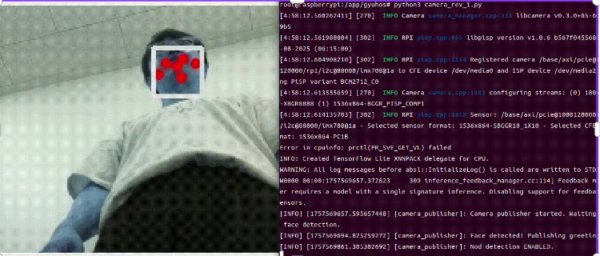

# App Waypoint - ROS2 기반 웨이포인트 네비게이션 시스템

이 프로젝트는 ROS2를 기반으로 한 자율주행 로봇의 웨이포인트 네비게이션 시스템입니다. 음성 인식(STT), 음성 합성(TTS), 웹 인터페이스를 통해 로봇이 미리 설정된 위치로 이동하고 작품에 대한 설명을 제공합니다.

## 🐳 Docker로 빠른 시작하기 (권장)

Docker를 사용하면 복잡한 설치 과정 없이 바로 실행할 수 있습니다:

```bash
# 기본 ROS2 이미지
docker pull elecs00/boo_ros:v1

# 오디오 기능이 포함된 이미지
docker pull elecs00/boo_ros:v1_audio

# 카메라 기능이 포함된 이미지  
docker pull elecs00/boo_ros:v1_cam
```

### Docker 컨테이너 실행 예시
```bash
# 기본 이미지로 실행
docker run -it --rm elecs00/boo_ros:v1

# 오디오 기능과 함께 실행 (마이크/스피커 접근)
docker run -it --rm --device /dev/snd elecs00/boo_ros:v1_audio

# 카메라 기능과 함께 실행 (카메라 접근)
docker run -it --rm --device /dev/video0 elecs00/boo_ros:v1_cam
```

> **💡 팁**: Docker를 사용하면 ROS2, Nav2, Python 의존성 등을 별도로 설치할 필요가 없습니다!

---

## 🚀 주요 기능

- **음성 명령 인식**: STT를 통한 목적지 음성 명령
- **자율 네비게이션**: Nav2를 활용한 경로 계획 및 이동
- **작품 설명**: Perplexity AI를 활용한 작품 설명 생성
- **장애물 회피**: 실시간 장애물 감지 및 경로 재계획
- **웹 관리 인터페이스**: 웨이포인트 추가/수정/삭제
- **상호작용**: 고개 끄덕임 감지를 통한 설명 요청

## 📋 시스템 요구사항

### Docker 사용 시 (권장)
- **Docker** 및 **Docker Compose**
- **Linux 환경** (Ubuntu 권장)

### 수동 설치 시
- **ROS2 Humble** (Ubuntu 22.04)
- **Python 3.8+**
- **Nav2** (Navigation2 패키지)
- **Flask** (웹 서버용)

### 하드웨어 요구사항
- LiDAR 센서 (SLAM 및 장애물 감지용)
- 마이크 (음성 인식용)
- 스피커 (음성 합성용)
- 카메라 (고개 끄덕임 감지용, 선택사항)

## 🛠️ 설치 방법

### 방법 1: Docker 사용 (권장)

#### 1. Docker 설치
```bash
# Ubuntu에서 Docker 설치
sudo apt update
sudo apt install docker.io docker-compose
sudo systemctl start docker
sudo systemctl enable docker
sudo usermod -aG docker $USER
# 로그아웃 후 다시 로그인 필요
```

#### 2. Docker 이미지 다운로드
```bash
# 필요한 이미지 다운로드
docker pull elecs00/boo_ros:v1
docker pull elecs00/boo_ros:v1_audio
docker pull elecs00/boo_ros:v1_cam
```

#### 3. 컨테이너 실행
```bash
# 기본 실행
docker run -it --rm elecs00/boo_ros:v1

# 오디오 기능 포함 실행
docker run -it --rm --device /dev/snd elecs00/boo_ros:v1_audio

# 카메라 기능 포함 실행
docker run -it --rm --device /dev/video0 elecs00/boo_ros:v1_cam
```

### 방법 2: 수동 설치

#### 1. ROS2 Humble 설치
```bash
# Ubuntu 22.04에서 ROS2 Humble 설치
sudo apt update
sudo apt install software-properties-common
sudo add-apt-repository universe
sudo apt update && sudo apt install curl
sudo curl -sSL https://raw.githubusercontent.com/ros/rosdistro/master/ros.key -o /usr/share/keyrings/ros-archive-keyring.gpg
echo "deb [arch=$(dpkg --print-architecture) signed-by=/usr/share/keyrings/ros-archive-keyring.gpg] http://packages.ros.org/ros2/ubuntu $(. /etc/os-release && echo $UBUNTU_CODENAME) main" | sudo tee /etc/apt/sources.list.d/ros2.list > /dev/null
sudo apt update
sudo apt upgrade
sudo apt install ros-humble-desktop python3-argcomplete python3-colcon-common-extensions python3-rosdep python3-vcstool
```

#### 2. Nav2 설치
```bash
sudo apt install ros-humble-navigation2 ros-humble-nav2-bringup
```

#### 3. Python 의존성 설치
```bash
# 프로젝트 디렉토리로 이동
cd app_waypoint

# Python 패키지 설치
pip3 install flask configparser requests
```

#### 4. 환경 변수 설정
```bash
# Perplexity AI API 키 설정 (작품 설명 생성용)
export PERPLEXITY_API_KEY="your_perplexity_api_key_here"

# 환경 변수를 영구적으로 설정하려면 ~/.bashrc에 추가
echo 'export PERPLEXITY_API_KEY="your_perplexity_api_key_here"' >> ~/.bashrc
source ~/.bashrc
```

## 🎯 사용 방법

### 1. 웨이포인트 설정
웹 인터페이스를 통해 웨이포인트를 설정할 수 있습니다:

```bash
# 웹 서버 실행
python3 web_server.py
```

브라우저에서 `http://localhost:5001`에 접속하여 웨이포인트를 추가/수정/삭제할 수 있습니다.

### 2. 메인 네비게이션 노드 실행
```bash
# ROS2 환경 설정 (수동 설치 시에만 필요)
source /opt/ros/humble/setup.bash

# 네비게이션 노드 실행
python3 waypoint.py
```

### 3. STT 결과 퍼블리셔 실행 (선택사항)
```bash
# 별도 터미널에서 STT 결과 퍼블리셔 실행
python3 androidstt.py
```

## 📁 파일 구조

```
app_waypoint/
├── waypoint.py          # 메인 네비게이션 노드
├── web_server.py        # 웹 관리 인터페이스
├── androidstt.py        # STT 결과 퍼블리셔
├── waypoints.ini        # 웨이포인트 설정 파일
└── README.md           # 이 파일
```

## ⚙️ 설정 파일

### waypoints.ini
웨이포인트 좌표를 저장하는 설정 파일입니다:

```ini
[작품명]
x = 3.0      # X 좌표
y = 3.0      # Y 좌표  
z = 0.053    # Z 회전 (쿼터니언)
w = 0.997    # W 회전 (쿼터니언)
```

## 🔧 ROS2 토픽 및 서비스

### 발행하는 토픽
- `/tts_text` (std_msgs/String): TTS로 재생할 텍스트
- `/stt_control` (std_msgs/String): STT 시작/중지 제어
- `/nod_control` (std_msgs/String): 고개 끄덕임 감지 제어

### 구독하는 토픽
- `/stt_result` (std_msgs/String): 음성 인식 결과
- `/distance` (sensor_msgs/Range): 장애물 거리 정보
- `/action/nod` (std_msgs/String): 고개 끄덕임 감지 결과
- `/action/greeting` (std_msgs/String): 인사 감지

### 사용하는 액션
- `navigate_to_pose` (nav2_msgs/action/NavigateToPose): 네비게이션 액션

## 🎮 사용 예시

1. **음성 명령**: "게르니카로 이동해줘" → 로봇이 게르니카 위치로 이동
2. **작품 설명**: 목적지 도착 후 고개를 끄덕이면 작품 설명 재생
3. **추가 질문**: 설명 후 추가 질문 가능
4. **홈 복귀**: "홈으로 이동해줘" → 시작 위치로 복귀

## 🐛 문제 해결

### 일반적인 문제들

1. **Nav2 액션 서버 연결 실패**
   ```bash
   # Nav2가 실행 중인지 확인
   ros2 topic list | grep navigate
   ```

2. **STT/TTS 토픽 연결 실패**
   ```bash
   # 토픽이 발행되고 있는지 확인
   ros2 topic echo /stt_result
   ros2 topic echo /tts_text
   ```

3. **웨이포인트 파일 오류**
   - `waypoints.ini` 파일의 형식이 올바른지 확인
   - 좌표값이 숫자인지 확인

4. **Perplexity API 오류**
   - API 키가 올바르게 설정되었는지 확인
   - 인터넷 연결 상태 확인

5. **Docker 관련 문제**
   ```bash
   # Docker 이미지 확인
   docker images | grep boo_ros
   
   # 컨테이너 실행 상태 확인
   docker ps
   ```

## 📝 라이선스

이 프로젝트는 MIT 라이선스 하에 배포됩니다.

## 🤝 기여하기

버그 리포트나 기능 제안은 GitHub Issues를 통해 제출해주세요.

## 📞 지원

문제가 발생하면 다음을 확인해주세요:
1. Docker가 올바르게 설치되었는지 (Docker 사용 시)
2. ROS2 환경이 올바르게 설정되었는지 (수동 설치 시)
3. 모든 의존성 패키지가 설치되었는지  
4. 하드웨어 센서가 정상 작동하는지
5. 네트워크 연결 상태

---

**주의사항**: 이 시스템은 실내 환경에서의 자율주행을 위해 설계되었습니다. 안전한 환경에서 테스트하고 사용하시기 바랍니다.

## 🔧 4륜 구동으로 변경하기

TurtleBot3를 4륜 구동으로 변경하려면 OpenCR 보드의 모터 드라이버 파일을 수정해야 합니다.

### 수정할 파일 위치
```
/home/hkit/.arduino15/packages/OpenCR/hardware/OpenCR/1.5.3/libraries/turtlebot3_ros2/src/turtlebot3/turtlebot3_motor_driver.cpp
```

### 변경 사항
1. **모터 ID 추가**: 기존 2개 모터(ID 1, 2)에 추가로 2개 모터(ID 3, 4) 설정
2. **뒤바퀴 설정**: ID 3, 4번 모터에 대한 초기화 및 제어 코드 추가
3. **동기화 제어**: 4개 모터 모두 동시 제어하도록 수정

### 주요 수정 내용
- `DXL_MOTOR_ID_LEFT_REAR = 3` (왼쪽 뒷바퀴)
- `DXL_MOTOR_ID_RIGHT_REAR = 4` (오른쪽 뒷바퀴)
- 뒤바퀴 모터 초기화 및 토크 제어
- 4륜 동시 속도 제어 (`write_velocity` 함수 수정)

### 주의사항
- OpenCR 보드의 Dynamixel 포트에 4개 모터가 모두 연결되어 있어야 함
- 모터 ID가 1, 2, 3, 4로 올바르게 설정되어 있어야 함
- 전원 공급이 4개 모터 모두 충분한지 확인 필요


## 📷 실제 환경 사진 (단일 이미지 표시)





